[toc]

# 仓库地址

[fc_embed](https://github.com/fool-cat/fc_embed)-github

[fc_embed](https://gitee.com/lord-it-over-a-district/fc_embed)-gitee

# RTE部署

准备一个空工程,保证空工程能运行!

从仓库地址拉取/下载代码 在cmsis-pack目录下有pack安装包,或者从release下载pack包

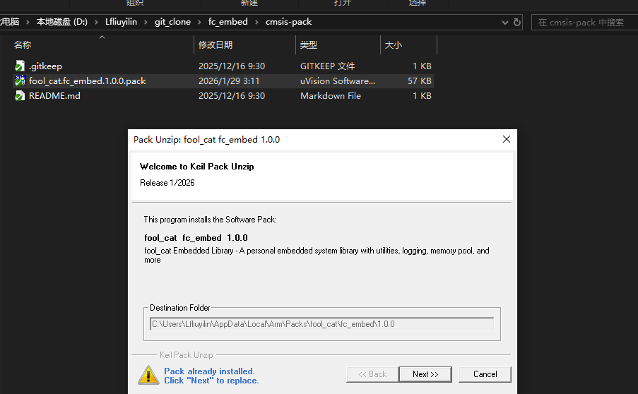

双击pack按照提示安装即可

打开keil工程,使用RTE组件,当前提供了

1. 自动初始化框架组件
2. 日志组件
3. 固定块大小分配(O(1))内存池组件,已实现原子安全无需其他锁
4. 串行port组件
5. 自定义序列化组件(类printf API)
6. 传输解码组件(未完善-当前仅提供可视化字符(常见于日志)聚合分包机制)

所有组件均可无操作系统依赖

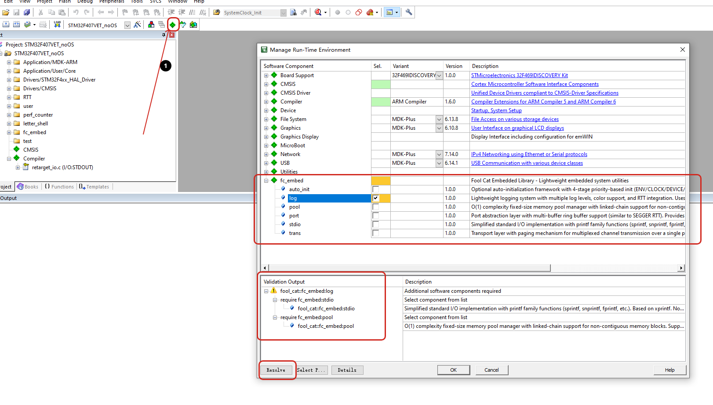

勾选使用对应组件时,勾选框背景变黄表示缺少依赖,下面详情会提示缺失项,左下角 `resolve`即可自动启用依赖,确认后视图如下

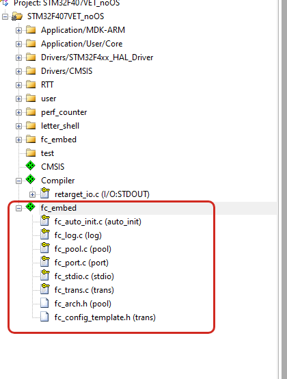

开启GNU拓展

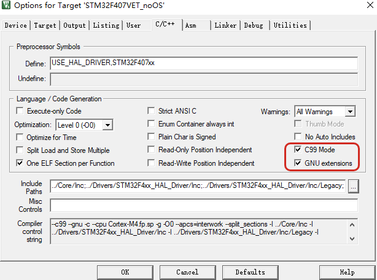

老版本keil开启GNU拓展需要在编译选项中开启(添加--gnu)

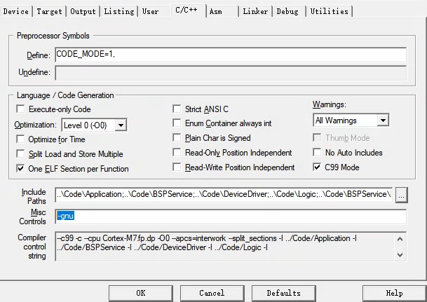

AC6编译器情况下开启GNU拓展

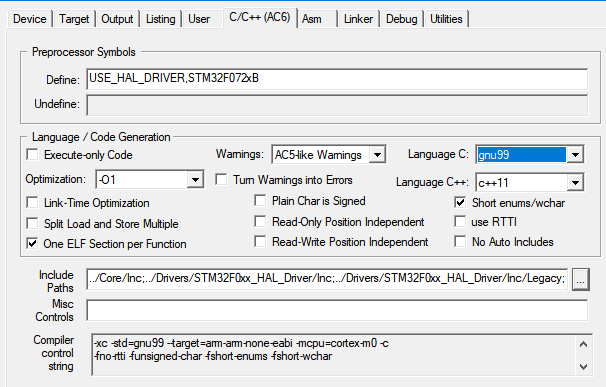

有些非标准流程创建的工程添加之后编译可能报错 #include"cmsis_compiler.h" 头文件找不到

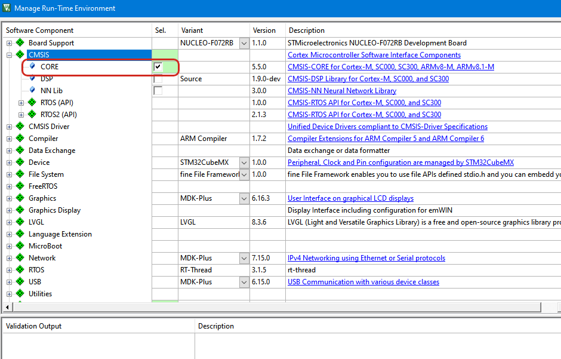

***!!!!!!!!!!!!!  重要  !!!!!!!!!!!!!***

> 在编译器任意可见(可被#include)目录下创建 `fc_config.h`文件
> 文件可为空,也可`include "fc_config_template.h"或者直接将其中内容拷贝过去

打开文件内容,提供图形化配置项,打开文件后点击文件下方 `configuration Wizard`如下

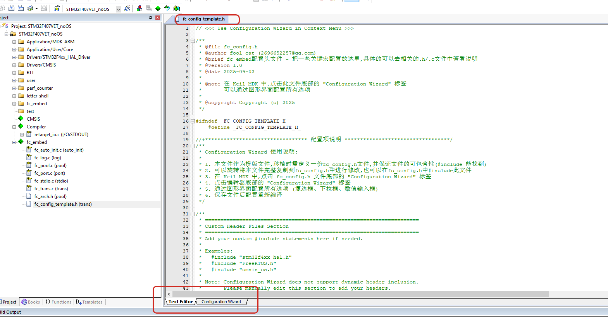

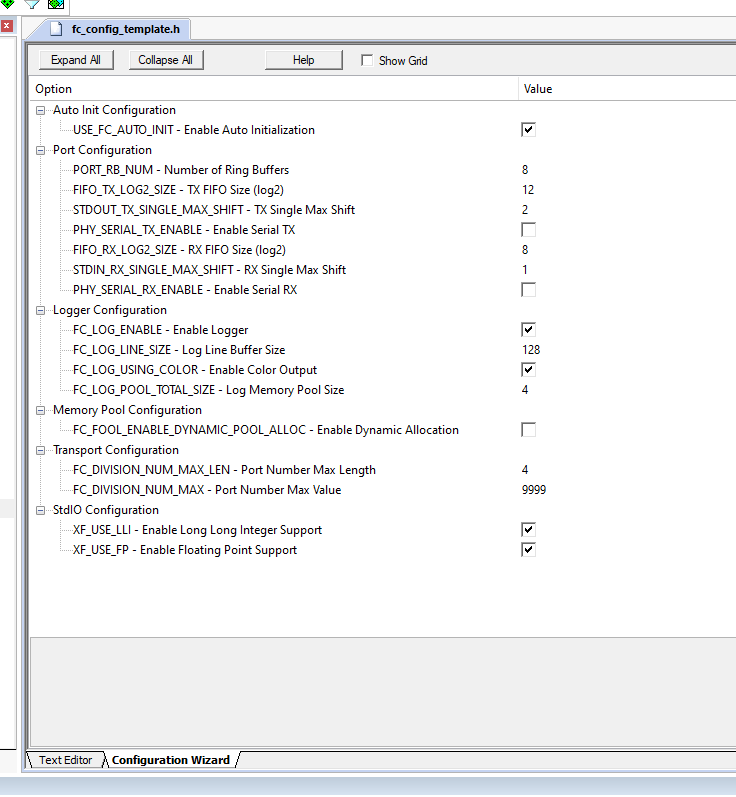

修改配置重编译即可--!!!修改之前最好知道其意义,配置文件中仅将常见配置项放入模版文件中,还有非常多可以配置项可以参考源码文件

重点内存项:

> #define FIFO_TX_LOG2_SIZE 12 // port tx0端口缓冲区大小(2的n次方),2^12
> #define FIFO_RX_LOG2_SIZE 8  // port rx0端口缓冲区大小(2的n次方),2^8

> #define FC_LOG_POOL_TOTAL_SIZE (4 * 1024) // 日志内存池大小(Byte)

# 源码部署

拉取仓库后,将core路径下(子目录不管)所有.c文件选择添加编译同时将core路径添加到头文件包含即可

依赖关系(必须)
log -> stdio & pool
port -> stdio
trans -> port

依赖关系(非必须)
以上所有都可以依赖 auto_init 但非强制需求

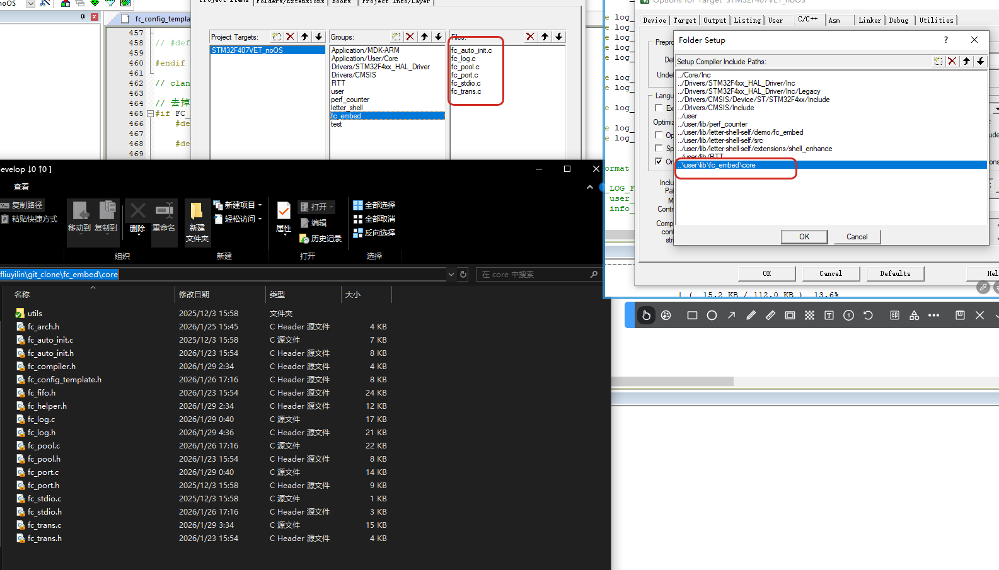

需要开启GNU拓展以及创建 `fc_config.h`配置文件,参考上面RTE部署中对这部分的描述

# 简要使用说明

## 自动初始化框架(fc_auto_init)

提供了四层默认的初始化框架->对应四个API调用

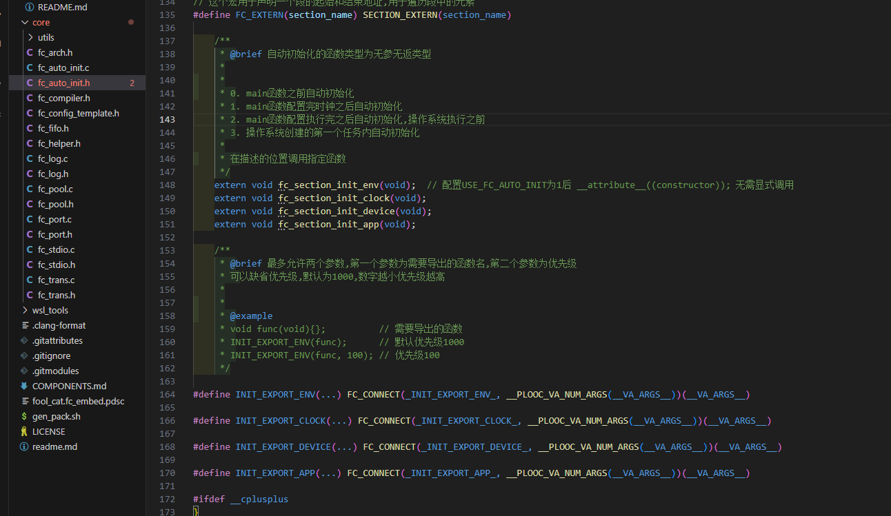

调用时机推荐如下

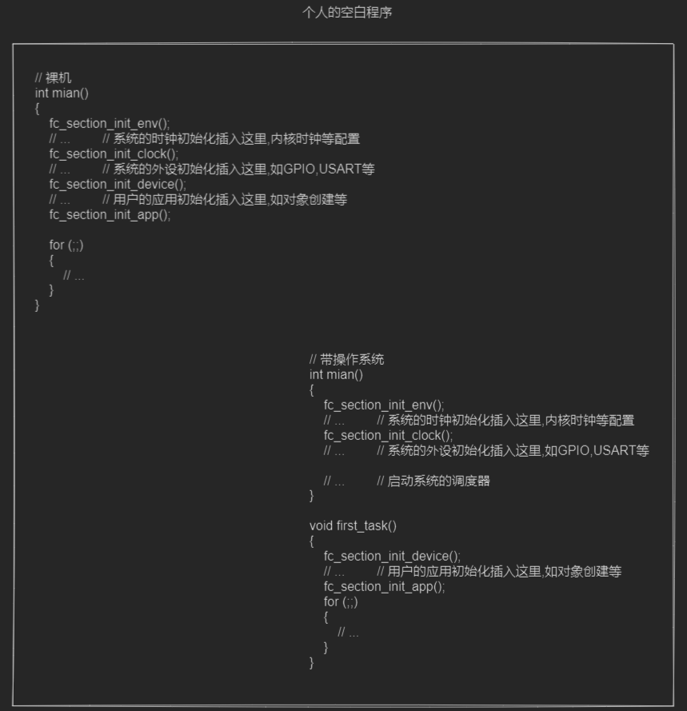

其中 `fc_section_init_env`默认会自动在main函数之前执行,无需手动调用,其他组件的对象初始化全部已通过 `INIT_EXPORT_ENV`宏注册到初始化段中

每个段均有对应的宏注册,使用方法如下

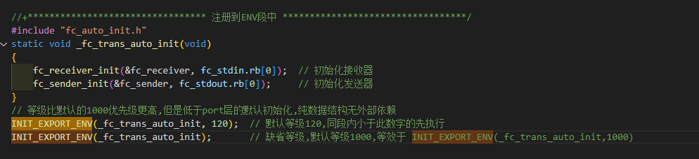

宏可接受1~2个参数,第一个参数为无参无返函数指针,第二个参数为优先级(数字越小越先执行),允许缺省优先级参数,默认为 `1000`

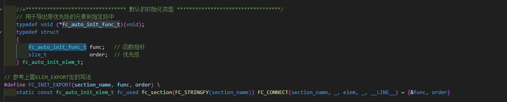

所有段初始化只会执行一次,重复调用无效!!!

## log

超高性能 `并行`log组件,具备以下优点

1. API统一无需区分中断/非中断
2. 文件级静态编译筛除指定等级以下日志
3. 运行时筛选特定等级以上输出
4. 作用域范围内日志可合并输出不用担心打乱
5. 无需额外锁机制无RTOS依赖
6. 自定义前后缀满足自定义日志风格需求
7. `无限制`单条日志长度

日志提供如下 宏API

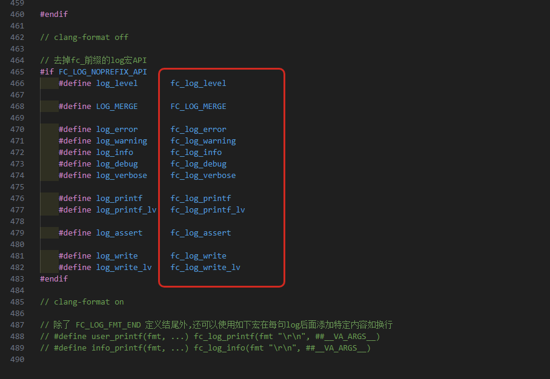

```C
#define fc_log_error(fmt, ...)  // 带格式日志输出
#define fc_log_warning(fmt, ...)
#define fc_log_info(fmt, ...)
#define fc_log_debug(fmt, ...)
#define fc_log_verbose(fmt, ...)

#define fc_log_printf(fmt, ...)             // 不带格式输出,等效于printf(默认最高等级,如果处于FC_LOG_MERGE作用域,将会设置为作用域内上一条日志等级)
#define fc_log_printf_lv(_level, fmt, ...)  // 显示指定等级

#define fc_log_assert(expr, ...)  // 断言,断言失败会打印当前比较信息(转为字符串)以及文件和行号,断言失败后允许自定义操作(可选)

#define fc_log_write(buf, len)             // 类似fc_log_printf,但是从指定地址输出指定长度
#define fc_log_write_lv(_level, buf, len)  // 显示指定等级

  

static void test_log(void)
{
    log_error("this is error log\r\n");
    log_warning("this is warning log\r\n");
    log_info("this is info log\r\n");
    log_debug("this is debug log\r\n");
    log_verbose("this is verbose log\r\n");

    log_assert(1 == 2);
    log_assert(false && "assert test", log_info("log断言宏支持>=1个参数,不能出现 `;` 可以使用 `{}` 作为一个表达式\r\n"));
    log_assert(false, {log_debug("多语句断言测试1\r\n"); log_debug("多语句断言测试2\r\n"); });

    log_assert(false, return);  // 断言失败直接返回
}

```

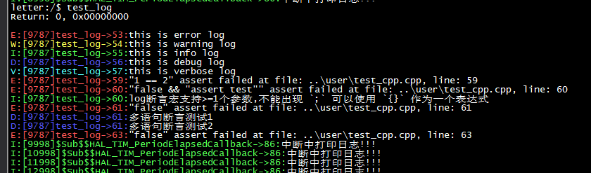

### 如何使用及自定义日志格式?

参考 fc_config_template.h,上述截图日志格式如下

```c
#define FC_LOG_PREFIX_FMT ":[%lld]%s->%d:" /**< 默认输出时间和当前函数名 */
#define FC_LOG_PREFIX_CONTENT __FC_LOG_MACRO_EXPANDING((int64_t)get_system_ms(), __FUNCTION__, (uint32_t)__LINE__)

```

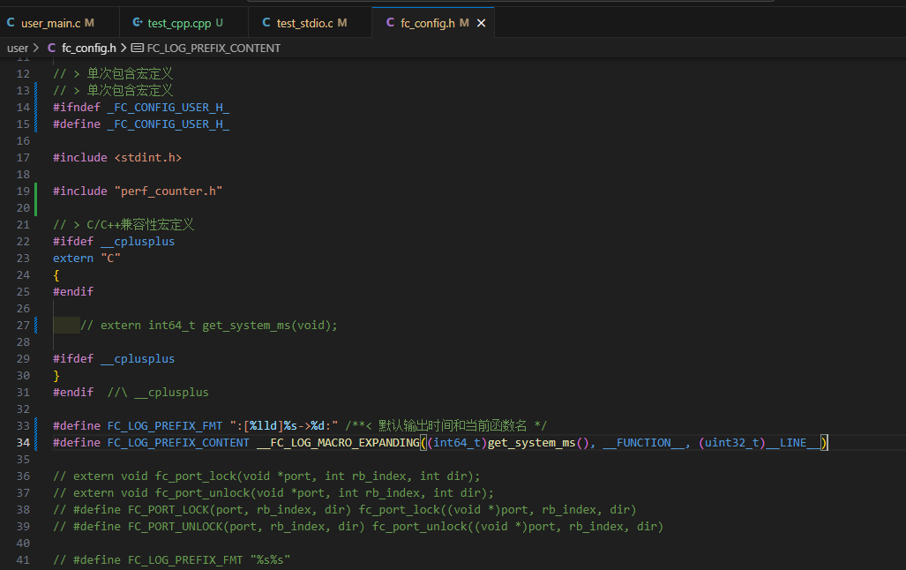

### 如何文件级日志筛除?

```C

    // #define FC_LOG_LEVEL_NONE       0  /**< 屏蔽所有/无视等级 */
    // #define FC_LOG_LEVEL_ERROR      1  /**< 错误 */
    // #define FC_LOG_LEVEL_WARNING    2  /**< 警告 */
    // #define FC_LOG_LEVEL_INFO       3  /**< 消息 */
    // #define FC_LOG_LEVEL_DEBUG      4  /**< 调试 */
    // #define FC_LOG_LEVEL_VERBOSE    5  /**< 冗余 */
    // #define FC_LOG_LEVEL_ALL        6  /**< 所有日志 */


#undef FC_LOG_FILE_LEVEL
#define FC_LOG_FILE_LEVEL FC_LOG_LEVEL_ERROR
#include "fc_log.h"
```

在一个.c文件内任意位置按照上述定义即可(同一个文件可以多次/任意重定义!)

1. #undef
2. #define
3. #include

从定义位置开始,往后的日志都将在编译期进行筛选

> #undef FC_LOG_FILE_LEVEL
> #define FC_LOG_FILE_LEVEL FC_LOG_LEVEL_ERROR
> #include "fc_log.h"

以此为例,当前文件从此往后的日志,只有FC_LOG_LEVEL_NONE和FC_LOG_LEVEL_ERROR可以输出,其他等级日志将在编译期筛除(代码中压根不存在),建议开启O(1)及以上,O(0)可能会保留无用代码占用空间

### 如何规避日志混乱输出问题?

RTOS环境或者裸机前后台框架经常出现,日志输出混乱

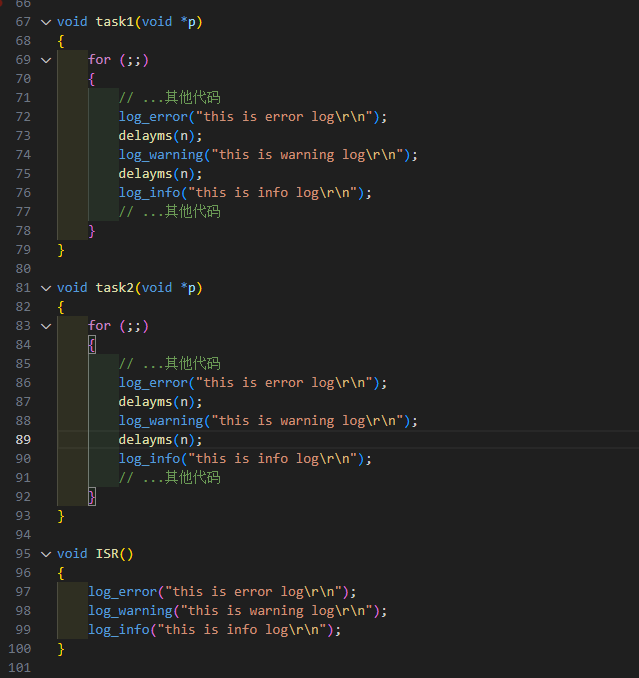

如图例子所示,task1与task2运行时各自输出日志,同时中断ISR中也会输出日志,单一函数中日志之间存在时间间隔,这期间可能会被其他日志插入导致日志混乱

解决方案--------`FC_LOG_MERGE`宏

使用 `FC_LOG_MERGE` 配合 `{}`将 `{}`作用域内的日志推迟到离开作用域再输出

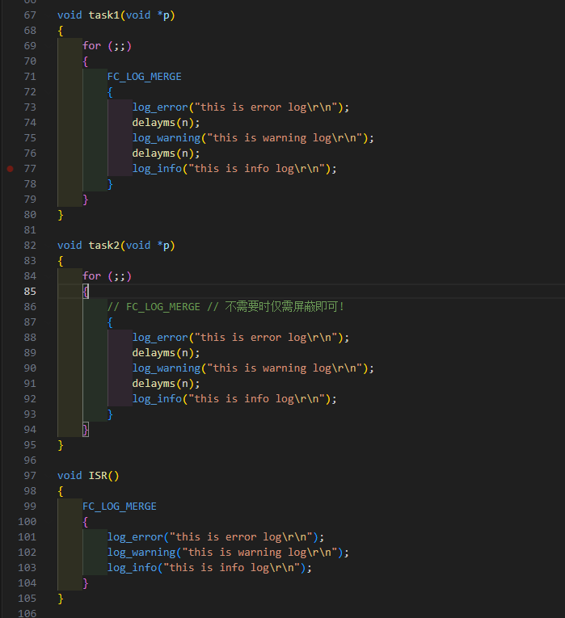

### 运行时日志等级切换

日志常见功能,不细讲,

> #define fc_log_level(_level)

注:fc_log_level在 `FC_LOG_MERGE`作用域中设置,不会影响当前作用域内的日志等级

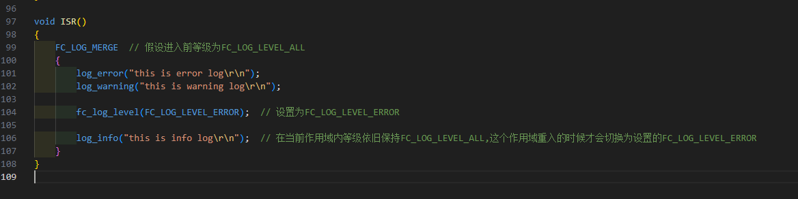

### 日志输出对接

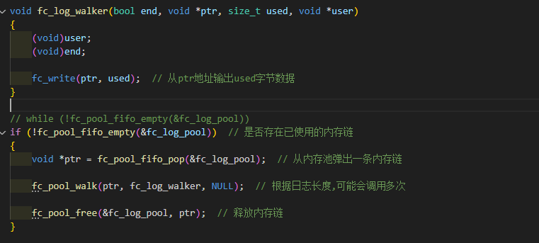

```C
void fc_log_walker(bool end, void *ptr, size_t used, void *user)
{
    (void)user;
    (void)end;

    fc_write(ptr, used);  // 从ptr地址输出used字节数据
}

// while (!fc_pool_fifo_empty(&fc_log_pool))
if (!fc_pool_fifo_empty(&fc_log_pool))  // 是否存在已使用的内存链
{
    void *ptr = fc_pool_fifo_pop(&fc_log_pool);  // 从内存池弹出一条内存链

    fc_pool_walk(ptr, fc_log_walker, NULL);  // 根据日志长度,可能会调用多次

    fc_pool_free(&fc_log_pool, ptr);  // 释放内存链
}

```

## port

与日志的 `并行`不同,port更偏向 `串行`!适用场景为物理IO缓冲!

使用port可以对接常规串口输出(DMA/IT/BLOCK任意形式均可),并且可以做到单消费者单生产者无锁且互不影响(本质队列),尤其适合物理IO的情况下减少锁机制的使用提升性能

详见fc_fifo设计

port中默认提供了实例化fc_stdin/fc_stdout,每个对象可以有 `PORT_RB_NUM`个端口,对于端口0已经提供了默认实现

### 对接参考

```C
//+********************************* 串口输出物理IO **********************************/
static size_t serial_output(size_t rb_index, char *buff, size_t len)
{
    switch (rb_index)
    {
    case 0:
        HAL_UART_Transmit_DMA(&huart1, (uint8_t *)buff, len);  // 由fc_out_trigger()触发,fc_out_end(size)通知已发送数据量
        break;

    default:
        break;
    }

    return 0;  // 目前返回值仅做保留
}

static size_t serial_input(size_t rb_index, char *buff, size_t len)
{
    switch (rb_index)
    {
    case 0:
        HAL_UARTEx_ReceiveToIdle_DMA(&huart1, (uint8_t *)buff, len);  // 由fc_in_trigger()触发,fc_in_end(size)更新已接收数据量
        break;

    default:
        break;
    }

    return 0;  // 目前返回值仅做保留
}

static void my_fc_stdio_init(void)
{
    fc_stdout_phy_catch(serial_output);  // 绑定到fc_stdout的物理发送触发函数,发送完需要调用fc_out_end通知
    fc_stdin_phy_catch(serial_input);    // 绑定到fc_stdin的物理接收触发函数,接收完需要调用fc_in_end通知
}
INIT_EXPORT_ENV(my_fc_stdio_init);
// INIT_EXPORT_DEVICE(my_fc_stdio_init);

//+*********************************  **********************************/
// 串口发送完成回调
__attribute__((used)) void $Sub$$HAL_UART_TxCpltCallback(UART_HandleTypeDef *huart)
{
    UNUSED(huart);

    if (huart->Instance == huart1.Instance)
    {
        fc_out_end(-1);    // 传输默认是传输完了上一次的,传入负数让其自行处理
        fc_out_trigger();  // 再次触发,能否立刻调用取决于物理IO(上面的serial_output)能否在这里调用
    }
}

// 串口接收完成回调
__attribute__((used)) void $Sub$$HAL_UARTEx_RxEventCallback(UART_HandleTypeDef *huart, uint16_t Size)
{
    UNUSED(huart);

    if (huart->Instance == huart1.Instance)
    {
        fc_in_end(Size);  // 接收数据多少就传入多少,可以传入-1表示调用物理IO输入时的数据量大小
        fc_in_trigger();  // 再次触发,能否立刻调用取决于物理IO(上面的serial_input)能否在这里调用
    }
}

int main()
{
    for (;;)
    {
        // 1. trigger能否调用完全取决于物理IO能否在trigger位置调用
        // 2. 可以多次调用trigger,在没有调用end之前,第一次trigger之后的trigger都会被忽略
        fc_out_trigger();
        fc_in_trigger();
    }
}


```

## trans (目前功能太鸡肋暂不推荐,完善中~)
